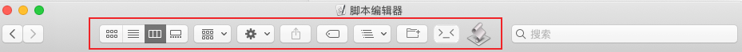
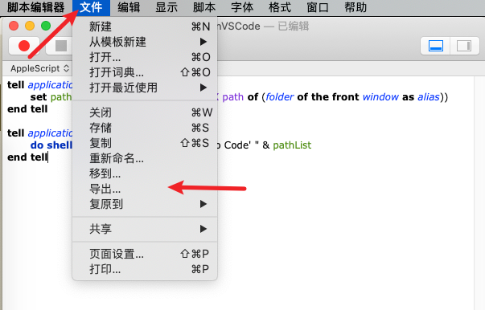
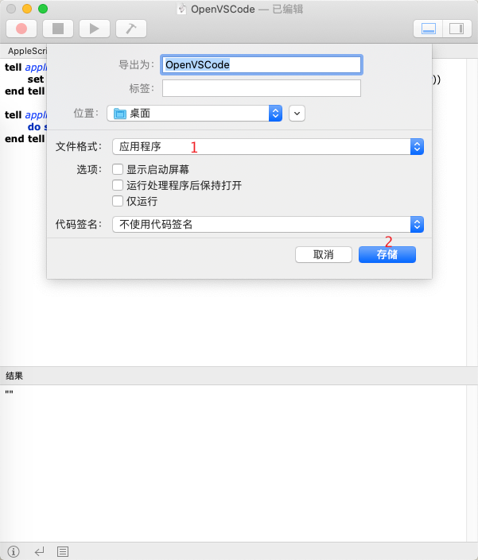
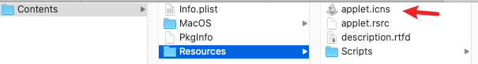

# Finder 工具栏-添加打开 VSCode 的按钮

## 背景

日常工作中，经常需要用 VSCode 查看当前目录里的文档，每次需要打开 VSCode 后，再把文件夹拖过去。次数多了，觉得很麻烦。

虽然官方提供了终端命令，可以用 VSCode 打开当前目录，但平时使用 Finder 的情况也不少，所以想要找一种方式，可以直接在 Finder 中直接打开 VSCode 的。

就像 [Go2Shell - ZipZapMac](https://zipzapmac.com/Go2Shell) 可以在 Finder 中打开当前目录的终端窗口一样。

## 如何实现

一开始找了很久如何实现 Finder 工具栏按钮，但相关资料太少了。后面换一种思路，找找有没有 Go2Shell 实现的资料，幸运的是，找到了 [Go2ShellAppleScript](https://github.com/wonderyue/Go2ShellAppleScript)，只要拿来改一改，就实现了以下功能：

 最右边则是自己制作的按钮，打开后，就会自动用 VSCode.app 打开当前文件夹。

## 具体实现

### 1. 代码
在 Mac 上打开「脚本编辑器」，输入以下代码：

```sh
tell application "Finder"
	set pathList to (quoted form of POSIX path of (folder of the front window as alias))
end tell

tell application "System Events"
	do shell script "open -a 'Visual Studio Code' " & pathList
end tell
```

### 2. 打包

如下图：





若嫌图标不好看，可以自行修改：


替换以下路径下的文件即可。


若嫌麻烦，可以直接使用笔者已经打包好的 app。

### 3. 安装

按住「cmd」键，直接将 OpenVSCode 拖到「Finder-工具栏」即可（会有+号提示）。


## 感谢

感谢 [wonderyue/Go2ShellAppleScript](https://github.com/wonderyue/Go2ShellAppleScript) 提供了详细的实现文档。